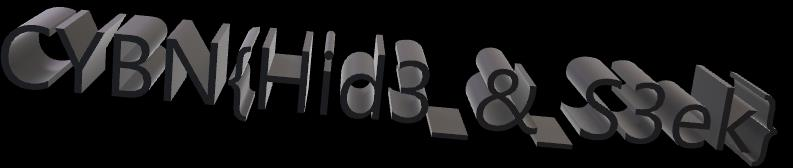

# Xray

> 25 points
>
> Easy
> 
> Pouvez-vous voir ce qui se cache derrière ce message ?
>
> Auteur : MrSheepSheep
>
> Flag : CYBN{Hid3_&_S3ek}

Nous allons utiliser un autre outil essentiel à la stéganographie, [ExtractPDF](https://www.extractpdf.com/)

En y chargeant le pdf du challenge et en regardant les images cachées, on y trouve ceci

Notre flag est donc CYBN{Hid3_&_S3ek}
