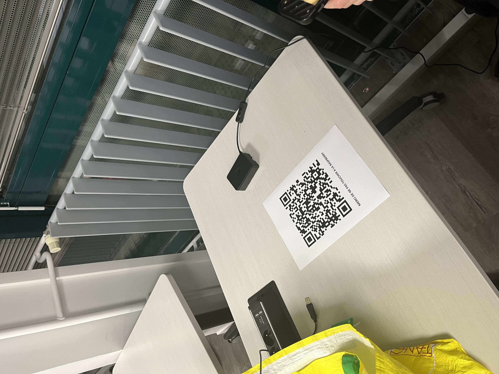

# Find Me 2/3

> 50 points
> Medium
> 
> Ok, ce point wifi n'est clairement pas légitime. Il faudrait le trouver sur le campus.
> A vous de trouver une méthode pour le localiser !
>
> Flag : CYBN{WTF_Rogue_AP?!}

En fouillant un peu partout, et surtout dans la salle avec les admins, on tombait sur un routeur et un QR Code. 

Ce QR Code dit : Bravo, le flag est CYBN{WTF_Rogue_AP?!}
