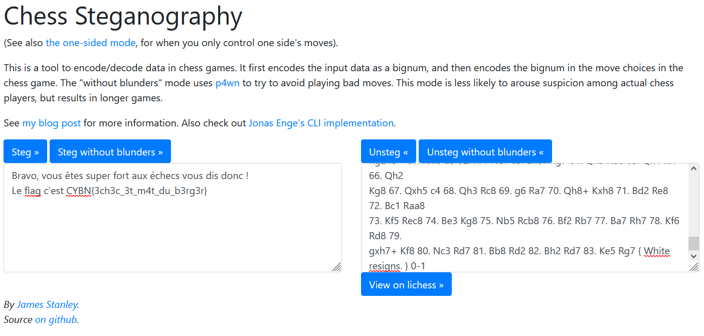

# Chess Master

> 25 points
>
> Easy
> 
> Juste des parties d'échecs, rien de suspect ici...
>
> Auteur : Maestran
>
> Flag : CYBN{3ch3c_3t_m4t_du_b3rg3r}

Dans le fichier zipé, on retrouve plusieurs fichiers de parties d'échecs. On va tous les tester dans un site de [stéganographie d'échecs](https://incoherency.co.uk/chess-steg/). 

Pour l'un d'entre eux, "Johannes H Donner_vs_Paul Keres_1996. .pgn", on trouve : 

CYBN{3ch3c_3t_m4t_du_b3rg3r}
